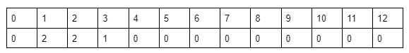

# Hashing

Let’s first try to understand the importance of hashing using an example:

Given an array of integers: [1, 2, 1, 3, 2] and we are given some queries: [1, 3, 4, 2, 10]. For each query, we need to find out how many times the number appears in the array. For example, if the query is 1 our answer would be 2, and if the query is 4 the answer will be 0. 

Similarly, the following will be the answers to the given queries:

## Brute Force

As we have learned the ‘for loop’, the first approach that should come to our mind is to use it to solve this problem. For each query, we will iterate over the array using a loop. We will count the number of times the query number appears in that array i.e. increment the counter variable if the array element at that index equals the query number. In terms of function, it will look like the following:

Now, for each query, we will call the function and it will return the number of times the given query appears in the array. 

### Time Complexity Analysis of function

We have learned how to compute the time complexity of any code. The above function contains a for loop that runs for N times. So, the time complexity of the function will be O(N) ignoring the other constant operations. 

Now, for each query, we are calling this function. So, if the query contains 5 numbers and we call the function 5 times, the total time complexity will be O(5*N). If the number of queries is Q, the time complexity will be O(Q*N). 

Now, if the length of the query becomes large like 105 and the array size also becomes large like 105, the time complexity will be O(1010).

We know from our previous knowledge that 108 operations take 1 second to get executed. So, 1010 operations will take around 100 seconds(1010/108). We cannot say a code is good if it takes 100 seconds to get executed.

## Optimized approach using Hashing:

### Definition of Hashing:
In order to optimize this approach, we need to use hashing. If we say the definition of hashing in a naive way, it is nothing but the combination of the steps, pre-storing, and fetching.

Now, let’s understand how to solve the given problem using the two steps:
Assumption: We are assuming that the maximum element in the given array can be 12.

Step 1 - Pre-storing: In this step, we will create an array(named hash array) of size 13(so that we can get the index 12) initialized with 0. In this hash array, we are going to store the frequency of each element(i.e. The number of times each element appears in the array) of the given array. To do so, we will iterate over the given array, and for each element arr[i], we will do hash[arr[i]] += 1. After completing this process the hash array will look like the following:

This step is named pre-storing as we are pre-calculating the information about the element of the array before answering the queries.

Step 2 - Fetching: In this step, we will select each query i.e. the number and for the query, we will just fetch the value of hash[number] and return it instead of running a ‘for loop’ every time. 

### Taken from Strivers A2Z sheet