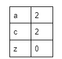
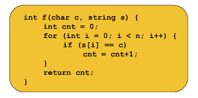

## Character Hashing:
Given the string: “abcdabefc” we are given some queries: [a, c, z]. For each query, we need to find out how many times the character appears in the string. For example, if the query is ‘a’ our answer would be 2, and if the query is ‘z’ the answer will be 0. 

Similarly, the following will be the answers to the given queries:



## Brute Force approach:
It is similar to the previous problem. Here, for each query, we will iterate over the string using a for loop and will count the number of times the character appears in that string i.e. increment the counter variable if the character at that index of the string equals the given character. In terms of function, it will look like the following:




Now, for each query, we will call the function and it will return the number of times the given character appears in the string. 

### Time Complexity analysis of the function:
It is as same as the one we calculated for the previous problem. If the number of queries is Q, the time complexity will be O(Q*N) where N = size of the string. 

Optimized approach using Hashing:
In number hashing, each index of the hash array represents an element in the given array. So, somehow, we need to map the characters of the string to an integer so that we can represent them using the indices of the hash array. So, let’s discuss the mapping technique:

### Mapping characters to integers:
In order to map the characters we need to use the ASCII values of the respective characters. The ASCII value of lowercase a is 97. So, if we write int x = ‘a’, it will typecast the character, ‘a’, into the ASCII value, 97, and store it in the variable x instead of throwing an error. So, similarly, if we write hash[‘a’], it will signify hash[97]. 

Now, we can do the mapping more efficiently for specific cases like the following:

Case 1 - If the string contains only lowercase letters: In this case, we can map the characters like:

‘a’ -> 0, ‘b’ -> 1, ‘c’ -> 2,....., ‘z’ -> 25. 
In order to get the corresponding value for a character, we will use the following formula:

corresponding value = given character - 'a'

For example, if the given character is ‘f’, we will get the value as (‘f’ - ‘a’) = (102-97) = 5.  Here, we can easily observe that the maximum value can be 25. 

So, for character hashing in this case, we need a hash array of size 26. And while pre-storing we will do hash[s[i]-’a’] += 1 instead of hash[arr[i]] += 1, and while fetching we will do hash[character-’a’] instead of hash[number]. The rest of the methods will be as same as in the case of number hashing.

Case 2 -  If the string contains only uppercase letters: In this case, we can map the characters like:

‘A’ -> 0, ‘B’ -> 1, ‘C’ -> 2,....., ‘Z’ -> 25. 
In order to get the corresponding value for a character, we will use the following formula:

corresponding value = given character - 'A'

Then the process will be similar to case 1.

Case 3 - If the string contains both uppercase and lowercase letters: We have 256 characters in total in this case. So, we will create a hash array of size 256. We will not subtract anything from the given character and will use the character as it is, to access the hash array while pre-storing and fetching. For pre-storing hash[s[i]] += 1 and for fetching we will use hash[character] only. The rest of the process will be exactly the same as in the number hashing.

Note: The case 3 method also applies to case 1 and case 2. In character hashing, the limit will not cross 256 and so we will always use this method.

The implementation is given below:

Code if the string contains only lowercase:

Code:

```
#include <bits/stdc++.h>
using namespace std;

int main() {

    string s;
    cin >> s;

    //precompute:
    int hash[26] = {0};
    for (int i = 0; i < s.size(); i++) {
        hash[s[i] - 'a']++;
    }

    int q;
    cin >> q;
    while (q--) {
        char c;
        cin >> c;
        // fetch:
        cout << hash[c - 'a'] << endl;
    }
    return 0;
}
```

 ### Code if the string contains both uppercase and lowercase:

 ```
 #include <bits/stdc++.h>
using namespace std;

int main() {

    string s;
    cin >> s;

    //precompute:
    int hash[256] = {0};
    for (int i = 0; i < s.size(); i++) {
        hash[s[i]]++;
    }

    int q;
    cin >> q;
    while (q--) {
        char c;
        cin >> c;
        // fetch:
        cout << hash[c] << endl;
    }
    return 0;
}

```

